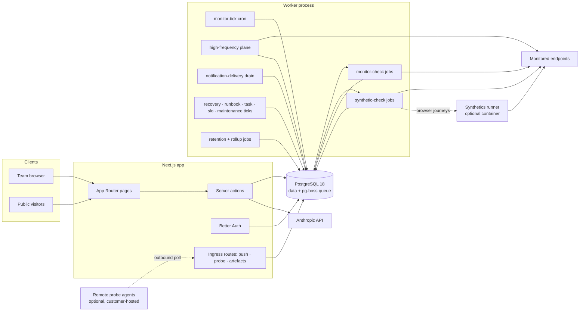
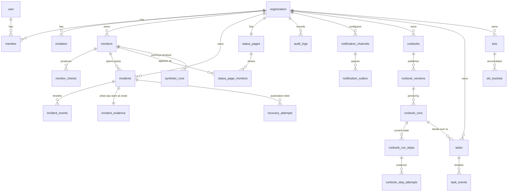
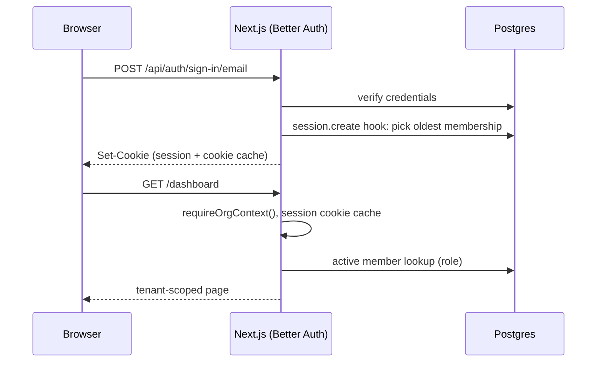
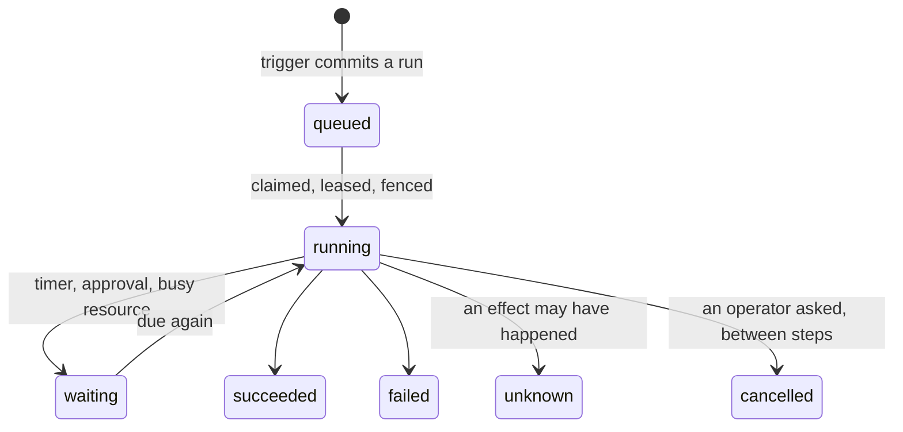

# Vigil. Architecture

This document explains how Vigil is put together and, more importantly, why.
For setup and product docs, see the [README](README.md).

## 1. System overview

Vigil is an uptime-monitoring, incident-management and operations platform.
Organizations create monitors, a background worker probes them on an adapting
schedule, failures open incidents automatically, and a public status page
keeps customers informed.

There are forty-two check types: HTTP(S), TCP port, ping, DNS record,
TLS-certificate expiry, domain expiry, PostgreSQL, MySQL/MariaDB, MongoDB,
Redis, Docker, MQTT, SMTP, JSON query, a real browser engine, and twenty-two
more spanning messaging, directory, mail and infrastructure protocols; two
scripted-synthetic types that run a whole journey rather than one request;
and three that are not probes at all, a push heartbeat whose silence is what
gets measured, a group derived from other monitors' states, and a manual
status an operator sets by hand (`docs/MONITOR-KINDS.md`). AI (Anthropic
API) drafts postmortems and public updates from incident timelines.

**The end-to-end shape is one line**: an observation lands, the status
controller decides what is true now, an incident opens, automation gets
first go at it (recovery triggers, then runbooks), what automation cannot
do becomes a task a person owns, and both halves are judged after the fact
against an objective and an append-only record. Each of those is a section
below; the seams between them are queues on the same Postgres, never a
service boundary.

The deployment shape is deliberately small, **two processes and one
datastore**, plus two optional planes that run nowhere until an
installation uses them:



- **Next.js app** (`src/app`): dashboard, settings, public status pages, auth
  endpoints, and the three unauthenticated ingress routes (push heartbeats,
  probe enrolment/poll/results, synthetic artefacts). All mutations are
  server actions.
- **Worker** (`src/worker`): a separate long-running Node process that owns
  every background job. It shares the app's code (schema, services) but not
  its runtime. Adding replicas adds capacity: there is no leader election,
  because Postgres already arbitrates who fires the cron, who runs the tick
  and who takes each piece of work (§5, `docs/SCALING.md`).
- **PostgreSQL 18**: the only stateful dependency. It stores both the domain
  data and the job queue (pg-boss creates its own `pgboss` schema).

Two more processes exist and neither is part of the default install:

- **Synthetics runner** (`src/synthetics-runner`, `Dockerfile.synthetics`):
  a browser and a fixed interpreter, dialled by the worker for
  `synthetic-browser` journeys only. It is internal infrastructure rather
  than an agent: it has no enrolment, holds no state and holds no database
  credential (§8c, `docs/SYNTHETICS.md` §8).
- **Remote probe agents** (`src/probe-agent`, `Dockerfile.probe`): the
  customer's own machines, executing assigned monitors and polling
  outbound-only. The controller never dials them (§5,
  `docs/REMOTE-PROBES.md`).

Both are commercial, and both are removed from the Core mirror by name
because a Dockerfile carries no edition marker (`docs/EDITIONS.md` §3.1).

### Why no Redis / message broker

The workload is thousands of scheduled checks per hour, not millions of
events per second. pg-boss provides scheduling, retries, per-key dedup
(`SKIP LOCKED` under the hood) inside Postgres, one datastore to operate,
back up, and reason about. If check volume ever outgrows this, the worker is
already a separate process with a queue abstraction; swapping the transport
is contained.

## 2. Code organization

```
src/
├── app/            # Next.js routes: thin, auth guard, parse, call service
│   ├── (auth)/     #   sign-in / sign-up / password reset
│   ├── (app)/      #   authenticated dashboard (sidebar shell)
│   ├── (print)/    #   the print layout branded client reports render in
│   ├── status/     #   public status pages (no auth, ISR-cached)
│   └── api/        #   Better Auth handler, demo login, and the three
│                   #   unauthenticated ingress routes: push heartbeats,
│                   #   probe enrol/poll/results, synthetic artefacts
├── modules/        # Domain logic, framework-free
│   ├── monitors/   #   check-type registry, probes, judge, scheduler policy
│   ├── incidents/  #   lifecycle state machine, hook registry, service,
│                   #   evidence: onset snapshot, burst, correlation
│   ├── recovery/   #   verified recovery loop: engine, schemas, service
│   ├── runbooks/   #   typed remediation: definition, engine, registry, runs
│   ├── tasks/      #   the human half: inbox, templates, hand-overs
│   ├── slo/        #   objectives, budgets, burn rules
│   ├── maintenance/#   windows, recurrence expansion, suppression
│   ├── routing/    #   alert-routing policies (the ee half of dispatch)
│   ├── synthetics/ #   journey model, interpreter contract, runs
│   ├── probes/     #   remote-probe dispatch, lease, quorum, settlement
│   ├── cluster/    #   worker heartbeat and the fleet read model
│   ├── importers/  #   fifteen sources behind one migration pipeline
│   ├── ledger/     #   the hash chain over observations
│   ├── reports/    #   branded client reports, frozen and hashed
│   ├── status-pages/
│   ├── notifications/ #   channels, providers, outbox, escalation delivery
│   ├── oncall/        #   on-call rotation math, schedules, escalation policies
│   ├── audit/
│   └── ai/         #   Anthropic client + prompt assembly
├── worker/         # pg-boss bootstrap + job handlers + the two in-process
│                   # planes (high frequency, probe settlement)
├── synthetics-runner/ # the browser service: config, server, interpreter
├── probe-agent/    # the remote agent: config, client, env guard
├── db/             # drizzle client + schema (one file per context)
├── lib/            # env, logger, session guards, permissions, editions, errors
└── components/     # UI (shadcn/ui in components/ui, shared pieces above)
```

The layering rule: **routes never touch tables, services never touch the
request**. Service functions take a `DbClient` (pool or transaction) plus an
explicit actor `{ organizationId, userId }`, which makes them directly
callable from server actions, the worker, and integration tests. This is the
whole "architecture", no repositories-of-repositories, no DI container.
Bounded contexts exist as folders (`monitors`, `incidents`, `status-pages`)
with one deliberate seam: the worker composes monitors + incidents +
notifications, so _monitor state transitions_ and _incident policy_ stay in
their own modules.

## 3. Database design



Read it as three layers rather than one graph. `monitors` and
`monitor_checks` are **observation**; `incidents` and their events are
**judgement**; `recovery_attempts`, `runbook_*` and `tasks` are **response**,
and `slos` reads back over the first layer to grade all three. Every one of
them hangs off `organization`, which is the only tenancy mechanism (below).

Decisions worth calling out:

- **Tenancy by `organization_id` column.** Every top-level domain table carries
  it, every service query filters by it, and the org id always comes from the
  session, never from client input. Child tables (escalation steps, schedule
  members, status-page components) inherit tenancy through their parent rather
  than repeating the column, so the rule that actually has to hold is the
  second one: **every client-supplied id is resolved against the acting
  organization before it is stored, and every read that turns an id into a
  person or a page joins back to the organization.** Both directions matter,
  1.10.0 fixed a case where they did not, and the write-side check alone would
  not have been enough, because the worker has no session to fall back on.

  Row-level security was considered and skipped: one application role talks to
  the database, so RLS would duplicate the service guards without adding a
  second independent enforcement point (documented trade-off; revisit if other
  consumers get SQL access).

- **UUIDv7 primary keys** (`uuidv7()`, native in Postgres 18) for domain
  tables, time-ordered, so B-tree inserts stay append-friendly without a
  separate sort key. Auth tables keep Better Auth's text ids.
- **`monitor_checks` is append-only time series** with a
  `(monitor_id, checked_at DESC)` index; a nightly job prunes rows past 90
  days. At one check/minute that's ~130k rows/monitor kept, fine for B-tree +
  aggregate queries; partitioning would be the next step, not a today problem.
- **Cached monitor state** (`current_status`, `consecutive_failures`) lives on
  the monitor row. Deriving status from the last N checks on every dashboard
  render would be correct but needlessly expensive; the worker is the only
  writer, so the cache has a single owner.
- **`incident_events` is the immutable record**: status changes, updates and
  system actions are events; the incident row holds only current state.
- **Audit log** rows are written in the same transaction as the mutation they
  describe, so the trail can't drift from the data.

## 4. Authentication & authorization

- **Better Auth** with the organization plugin: email+password sessions
  (cookie-cached, DB-backed), organizations, invitations, and member roles in
  our own Postgres.
- **Roles**: `owner`, `admin`, `responder`, `viewer`: are defined once in
  [`src/lib/permissions.ts`](src/lib/permissions.ts) as an access-control
  matrix over resources (`monitor`, `incident`, `statusPage`, `member`,
  `invitation`, `organization`). The same matrix drives the server guards,
  Better Auth's own endpoints, and conditional UI.
- **Guard chain** for every server action:
  `requirePermission(permission)` → resolves session (React `cache`d per
  request) → resolves active-org membership → checks the role matrix locally
  (no extra round-trip) → returns `{ userId, organizationId, role }` used for
  all queries.
- `proxy.ts` (Next 16's middleware successor) only does optimistic
  redirect-to-sign-in on missing session cookies; it is UX, not security.
  Real enforcement lives in layouts, pages and actions.

Auth flow (sign-in):



## 5. Monitoring pipeline

The scheduling model is a **cron fan-out**, not per-monitor timers:

1. `monitor-tick` (pg-boss cron, every minute, singleton policy) queries
   monitors that are due, `next_evaluation_at` reached, allowing 30s of
   slack for tick alignment, or never scheduled, and enqueues one
   `monitor-check` job per monitor. The query contains no interval
   arithmetic: _when_ was decided by `nextEvaluationAt(spec,
recentObservations)` when the last observation landed, so changing the
   scheduling policy never means touching the scheduler. A check whose
   next evaluation falls inside the tick period enqueues its own
   follow-up rather than waiting for the next minute.
2. `monitor-check` jobs run with per-monitor dedup (queue policy `stately` +
   `singletonKey = monitorId`): at most one queued and one active check per
   monitor, so a slow target can't pile up probes. Handlers never retry.
   The next tick is the retry.
3. Each check: DNS-resolve and **refuse private address space** (SSRF guard),
   probe with timeout, and emit _facts_. The type's declared assertions are
   then judged by one shared engine into a verdict, `up`, `degraded`,
   `down`, or `indeterminate` when the probe could not run at all. The
   observation is persisted with its facts and its ledger stamp, and monitor
   state advances, in one transaction.
4. The status controller is **level-triggered**: it asks what is true now,
   never what just changed. A monitor is `down` once it has been failing for
   `failure_window_seconds`; while inside that window it keeps the last
   status actually established. Being safe to run repeatedly is the point,
   a monitor that ended up down with no incident, or up with a stale open
   one, repairs itself on the next check. `down` opens an incident
   (idempotent: one open auto-incident per monitor) and notifies
   owners/admins/responders, or holds the notifications if the monitor's
   recovery action asks to, and hands the incident to the recovery loop. An
   incident resolves only when a probe **observed** the target healthy. A
   derived status is not proof of recovery, and `indeterminate` resolves
   nothing.

This design is self-healing (a missed tick just means the next one picks up
the backlog), horizontally scalable (multiple workers coordinate through the
queue), and has no schedule state to corrupt beyond a timestamp that is
recomputed on every check.

### The check type registry

A check type is data, not a branch. `src/modules/monitors/types/` holds one
object per type, a descriptor, a zod spec, a set of declared assertions and a
probe, and dispatch is a map lookup. There is no `switch` on `checkType`
anywhere in the product, and adding a type changes no existing code path.

Two rules hold it together.

**Probes measure; the runner judges.** A probe returns _facts_ and, at most, a
transport error. It never returns `ok` or `degraded`. The verdict comes from
`judge()`, which evaluates the type's declared assertions against those facts.
Because that is a pure function of `(assertions, spec, facts)`, a stored
observation can be re-judged later, against a different spec version, or by a
verifier that never ran the probe, without re-probing anything. A type that
returned its own verdict would make the shared engine advisory and take that
property away.

**Three answers, not two.** Beyond `up` / `degraded` / `down` there is
`indeterminate`: the probe could not run here at all. ICMP without a raw
socket, a check type a downgraded build no longer has, a registry that does not
publish the field. It is deliberately not `down`, because an operator error
that is indistinguishable from an outage is the one failure a monitoring
product may not have. It reaches the operator as `unknown`, is excluded from
every uptime aggregate rather than counted as downtime, never opens an
incident, and never closes one.

The split across three directories is load-bearing rather than tidiness:
`catalog.ts` is plain data with no zod and no `node:` imports, because the
monitor form imports it into the browser; `specs/` adds validation and is
isomorphic; `probes/` reaches for `node:dns`, `node:net`, `node:tls` and
`node:child_process` and is server-only. Type-specific settings live in a
nullable `config` jsonb column, so a new type needs no migration.

### The high-frequency plane

The cron fan-out above has a floor of one minute, because that is
pg-boss's cron floor, and the ordinary scheduler's own minimum interval
is two seconds. HTTP, JSON-query and TCP monitors can instead be run at
500 ms by a **second data plane in the same worker process**
(`HighFrequencyPlane`, `modules/monitors/highfreq`), and the separation
is the point: a scheduler whose slots are half a second apart cannot
share an event loop with a job runner that occasionally spends seconds
on an aggregate.

Three properties are worth stating because they are what the plane costs
and what it buys:

- **It shards by lease.** Sixteen shard leases divide the enabled
  monitors across whatever replicas are running. A worker that dies has
  its shards taken over when its lease expires, and until then those
  monitors fall back to the ordinary tick, degrading from 500 ms to the
  configured baseline rather than to silence.
- **It is idle by default and costs one query.** With no monitor enabled
  the whole footprint is a discovery `SELECT` every two seconds; the
  leases and the 25 ms scheduler start in the reload pass that first
  sees a monitor. It is deliberately not behind an environment variable,
  because a setting an operator can save on a deployment where nothing
  honours it is worse than no setting.
- **Its raw samples are a buffer, not history.** `monitor_hf_samples` is
  a two-hour window; a minute cron rolls it into minute, hour and day
  buckets and drops what it aggregated. The rollup runs on the queue
  rather than inside the plane so that a multi-second aggregate can
  never become a monitor's cadence.

Measured cadence, the resource cost of each fleet size and the point
where the plane stops keeping up are in `docs/HIGH-FREQUENCY.md`, which
also states plainly that a 500 ms interval is not a 500 ms detection
time.

### Scripted synthetics (commercial)

`synthetic-api` and `synthetic-browser` are check types like any other in
the registry, and everything below the seam is unchanged: they produce an
observation, it is judged, and the status controller does the rest. Two
things about them are architectural.

**A journey is data, never code.** There is no expression evaluator, no
template with function calls, no regular expressions and no
`page.evaluate`. The reason is not taste: the worker holds the
installation's database, notification and recovery credentials, and "run
this user's JavaScript" in that process is a decision to give every
operator-editable field the authority of the process itself. What an
operator writes is a list of typed steps whose text can only become a
value. Everything a journey declares is therefore decidable before it
runs, and `checkJourney()` decides it at save time; the executor has no
"unknown variable" branch because a journey with one cannot be saved.
`docs/SYNTHETICS.md` §1 is the long form, including what the decision
costs (no loops, no branching, no arithmetic).

**Journeys get their own queue, and that is what makes them safe to
host.** A browser journey holds its slot for as long as a customer would
take to click through the thing being tested, and `monitor-check` runs
two jobs at a time per replica. Two journeys on the general queue is an
installation whose HTTP monitors quietly stop being checked, and the
operator's evidence for it would be a scheduler-lag graph with no cause
on it. So `synthetic-check` has its own concurrency
(`SYNTHETIC_CONCURRENCY`, default 2) and its own backpressure
(`SYNTHETIC_QUEUE_MAX_DEPTH`): past that depth the tick leaves synthetic
monitors due rather than piling them up. The general queue keeps the
latency profile it had before the feature existed.

A run is claimed on `(monitorId, scheduledFor)` in `synthetic_runs`
before anything executes, so a job pg-boss redelivered after a restart, a
duplicate from a racing tick and a fast follow-up all collapse onto one
run, and the replicas that lose the claim stop without opening a browser
or issuing the journey's requests. The runner process itself is §8c.

### Remote probes and quorum (commercial)

A monitor can be executed by **remote probe agents** the customer runs on
their own machines instead of by the controller. Operator manual:
`docs/REMOTE-PROBES.md`.

Two words in this repository are now spelled "probe" and they are not the
same thing. `modules/monitors/types/probes/*` is the function that dials a
target for one check type, and has been since 1.10.0. `modules/probes/` is a
remote agent process. The second is the customer-facing word, so it keeps the
plain name; nothing imports both.

The pipeline is unchanged above and below the seam. `runMonitorCheck` asks
`dispatchToProbes(monitor)`; a monitor with no policy or a `local` one gets
`false` and the four steps above run exactly as they always have. Otherwise:

1. **Dispatch** opens a `probe_rounds` row and one `probe_jobs` row per
   assigned probe, and freezes the membership and the thresholds into the
   round. Freezing is what makes a decision reconstructable: a policy edited
   or a probe revoked mid-round cannot change what the round was asked.
2. **Lease.** Probes poll outbound; the controller has no route to them and
   never will. One `UPDATE ... FOR UPDATE SKIP LOCKED` claims work and stamps
   a fresh `attempt_id`, which is the idempotency key and the replay defence
   in one. The job carries the spec from `toCheckSpec`, the same mapping a
   local check uses, so a remote probe can never measure a laxer version of
   the monitor.
3. **Report.** Every result is written, including refused ones, with
   `accepted = false` and a reason (`late`, `stale_attempt`, `round_decided`).
   A refused result is the evidence that a probe was slow, which is exactly
   what an operator wants when the quorum came up short. The endpoint judges
   nothing and can page nobody, for the same reason `/api/push/<token>`
   cannot.
4. **Decide.** A one-second loop in the worker settles rounds that are
   complete or past their deadline. `decideQuorum` is pure. Its output is
   converted to a `CheckResult` and handed to the same `applyOutcome`
   everything else uses, so incidents, uptime, the ledger and the status page
   cannot tell a remote monitor from a local one.

Three invariants are enforced by Postgres rather than by sequencing:

| Invariant                  | Mechanism                                                                                          |
| -------------------------- | -------------------------------------------------------------------------------------------------- |
| One open round per monitor | partial unique index on `(monitor_id) WHERE decided_at IS NULL`                                    |
| One decision per round     | `UPDATE ... SET decided_at = now() WHERE decided_at IS NULL RETURNING *`                           |
| One result per job         | unique index on `probe_results(job_id)`, plus a BEFORE UPDATE trigger making the table append-only |

The second is the whole of "incidents fire once per aggregate transition,
never once per probe".

Quorum resolves K against the frozen membership size, never against how many
answered: a threshold computed from responders would make `majority` on three
probes quietly become 2-of-2 whenever one agent was asleep. **A probe that did
not answer is never counted as a failure** in any mode; below `min_responders`
the round is `insufficient_quorum` and the verdict is `indeterminate`, which
the status controller already refuses to read as either an outage or a
recovery. Dissent below the threshold is `partial_failure` and reports
`degraded`: a target a third of the world cannot reach is not healthy and is
not an outage.

Credentials are SHA-256 in the database and nowhere else; the plaintext exists
for one response. Revocation clears both hashes _and_ sets `revoked_at`, so two
independent things have to fail before a revoked credential works. The agent
overwrites `DATABASE_URL` at start-up (`probe-agent/env-guard.ts`) so a
misplaced `.env` cannot give a remote box a database credential, and it applies
its own `ALLOW_PRIVATE_MONITOR_TARGETS` rather than anything the controller
sends.

Vigil operates no probe, region or relay. The feature ships the software; the
machines are the buyer's.

### Recovery loop

Each monitor may have one **recovery action**: a customer-controlled HTTP
endpoint (restart hook, runbook trigger) that Vigil calls with a signed
`recovery.execute` payload, same HMAC-SHA-256 scheme as webhooks. The loop
is deliberately conservative:

1. `recovery-execute` re-probes the target first, a stale detection never
   triggers anything. Still down → fire the signed trigger, then schedule
   `recovery-verify` after the configured delay.
2. `recovery-verify` probes again: success is **observed, never assumed**.
   Failure retries after a cooldown up to `maxAttempts` (1-5 per incident),
   then stands down. The incident stays open for a human.
3. Bounds beyond the per-incident cap: a fixed restart-loop guard (10
   executed triggers per monitor per 24 h, a flapping target re-opens
   incidents and would loop forever) and a nightly sweep that closes
   attempts orphaned by worker interruptions.
4. With `holdAlerts`, opened-notifications wait for the loop: a verified
   recovery pages nobody; failure, exhaustion or a worst-case deadline
   (`recovery-escalate`, scheduled up front so a dead chain can't swallow
   an alert) fires them exactly once, a `notified_at` claim on the
   incident arbitrates between the competing senders in Postgres.

Every attempt is an immutable row in `recovery_attempts` (pre-check result,
trigger delivery, verification, timings) plus system events on the incident
timeline. Resolving the incident stays owned by the regular check loop. A
verified recovery is confirmed by the next passing check.

### Incident evidence

An incident that opens gets a snapshot of what was known at that moment,
in a table of its own (`incident_evidence`, one row per incident). It
holds the failing observation, the last successful one, the meaningful
differences between them, what a bounded diagnostic burst found, and
which other monitors were failing for a signal we can name.

**A table rather than a query**, because every input to "why did this
open" expires: observations are pruned at ninety days, the monitor's
history is rewritten by every later check, and the correlated failure has
recovered by the time anyone reads the page. `incident_id` is the primary
key and the insert is `on conflict do nothing`, so the idempotency
guarantee is Postgres's rather than the application's: a retry, two
workers repairing the same unhandled incident, and a flap inside one
incident all produce one snapshot: the first one committed.

**The layer is stated with its basis.** `measured` (a diagnostic re-probed
it and it failed), `reported` (the failure names it, as `ENOTFOUND` came
from a resolver), `assertion` (the target answered, so the observation
proves the transport), or `unknown`. A bare timeout names no layer and is
filed `unknown` unless a diagnostic resolves it; guessing would put a
sentence on an incident page that is wrong often enough for an operator
to stop reading the field.

**The burst is bounded and consequence-free**: four read-only probes
(resolve, connect, handshake, request), one socket each, no redirects,
5s total, two concurrent per worker, 32KB of storage. It writes no
observation, moves no status, touches no incident, pages nobody, feeds no
SLO and reaches no status page. It runs after the page has been claimed,
never before, and shadow mode refuses it outright. Same egress policy as
the check itself.

**Correlation is a rule, not a score**: time proximity within ten minutes
_and_ a strong shared signal (host, registrable domain, resolved address,
failure signature, probe location), each carrying the value it matched
on. A shared timeout is not strong: it is the most common failure there
is. Scoped to the organisation inside the query.

The commercial editions enrich the snapshot with a journey's failed step
(screenshot referenced by id, never copied) and what the remote probes
saw. See `docs/INCIDENT-EVIDENCE.md`.

### SSRF posture

Monitor URLs are validated twice: at input (public domain names only, no IP
literals, no localhost, metadata hostnames blocked) and at probe time (the
worker resolves DNS and rejects targets in private/link-local/CGNAT ranges
unless `ALLOW_PRIVATE_MONITOR_TARGETS` is set for development). Known residual
risk: the probe's `fetch` re-resolves DNS, so a rebinding server could flip
records between checks; full mitigation (pinning the resolved IP or an egress
proxy) is documented future work.

## 6. Public status pages

`/status/[slug]` is the unauthenticated, high-traffic surface. It is
**ISR-cached (60s revalidate)**: during an outage, traffic spikes hit the
cache, not Postgres. The read model (`getPublicStatusPage`) is assembled in
one service call and exposes only public-safe data: display names (never
URLs), daily uptime buckets, and incident timelines. System-generated
incident messages are deliberately generic because raw check errors can embed
internal hostnames.

## 7. AI features

- Server-side only (`src/modules/ai`), using `claude-opus-4-8` with adaptive
  thinking. The API key is optional, without it the UI simply doesn't offer
  AI actions.
- Two features: **postmortem drafts** (structured, blameless, grounded in the
  timeline, explicitly told to write "To be filled in" rather than invent
  facts) and **public status-update suggestions**.
- Guardrails: permission-gated server actions, per-organization rate limit
  (10 generations/hour), prompts assembled from our own data with no
  user-supplied instructions in the system prompt, and every output lands in
  an editable textarea, a human saves it, the AI never writes to the
  database.

## 8. Notifications

Notifications live in `src/modules/notifications` and have two channels
that never block incident processing. Both are dispatched _after_ the
triggering mutation has committed, and neither can throw back into it.

**Flow.** Monitor-driven events fire from the worker
(`src/worker/jobs/monitor-check.ts`) on the same reconciliation that opens
and resolves incidents, `openIncident` and `resolveIncidents` off the
status controller, not on transitions. Manual incident events fire from
the incident server actions after they commit. Both call into the same
notification functions.

**Email.** `EmailTransport` is a one-method interface. The default
transport logs structured lines; setting `RESEND_API_KEY` swaps in the
Resend transport (plain `fetch`, no SDK) at module load. Call sites are
unchanged, and a future SMTP/SES transport is another file implementing
the same interface. Templates (`email-templates.ts`) return matching
HTML and plain-text bodies; recipients are the org's owners, admins and
responders (assign roles to change who is paged). Delivery failures are
logged and swallowed.

**Webhooks.** One endpoint per organization (`webhook_endpoints`), with a
generated secret and an enable switch, configured under
_Settings → Notifications_. When enabled, Vigil POSTs a compact,
versioned JSON envelope for each event:

```json
{
  "version": 1,
  "event": "incident.opened",
  "timestamp": "2026-07-02T12:00:00.000Z",
  "organization": { "id": "…" },
  "data": {
    "incident": { "id", "title", "status", "severity", "source",
                  "startedAt", "resolvedAt", "url" },
    "monitor":  { "id", "name", "url", "status" }
  }
}
```

Events: `incident.opened`, `incident.updated`, `incident.resolved`,
`monitor.down`, `monitor.up` (plus `webhook.test`). Each request carries
`X-Vigil-Event` and `X-Vigil-Signature: sha256=<hex>`: the HMAC-SHA-256
of the exact request body keyed by the endpoint secret. Receivers verify
by recomputing the HMAC over the raw body. Delivery retries transient
failures (network errors, timeouts, 5xx, 429) with exponential backoff,
does not retry a permanent 4xx, times out per attempt, and gives up after
a bounded budget, always returning a result, never throwing.

**Escalation & on-call.** A monitor may carry an
`escalation_policy_id`. When such a monitor opens an incident, the worker
schedules the policy's ordered steps (`src/worker/jobs/escalation.ts`):
one `escalation-step` job per step, each with `startAfter =
delayMinutes × 60`. When a step fires it re-reads the incident and stops
if it is `resolved` or has an `acknowledged_at`: so acknowledging (or a
verified recovery resolving) the incident halts the whole ladder without
cancelling queued jobs. Each step resolves its target to concrete
recipients at fire time: the **on-call person** (rotation math in
`modules/oncall/rotation.ts`: pure `floor((now − anchor)/day / rotationDays)`
wrapped over the ordered members), **all responders** (owner/admin/
responder members), or a **specific person**. It then delivers over one
channel (`modules/notifications/channels.ts`): **email** (the transport
above) or **SMS/voice** via Twilio.

Every step records an _internal_ system event (never shown on the
public status page) summarising who was paged. Monitors with no policy
keep the original behavior: notify owners/admins/responders once.

Schedules and policies are managed under _Settings → Escalation_; a
member's escalation phone lives on their profile. The direct open path
drives the policy (it has the queue); recovery's own escalate failsafe
(no queue handle) falls back to notifying responders by email.

**Status-page subscriptions.** Visitors to a _public_ published status
page can subscribe by email (`status_page_subscribers`). Double opt-in:
subscribing writes a pending row and emails a confirmation link;
`notifyStatusPageSubscribers` only ever pages rows with a `confirmed_at`.
Confirm/unsubscribe links carry a self-authenticating token,
`${subscriberId}.${hmac(subscriberId)}` signed with `BETTER_AUTH_SECRET`,
so the server acts from the token alone, with no guessable ids in URLs
and no second secrets table. Subscribers are notified at the same seam as
webhooks (`incident.opened` / `.updated` / `.resolved`), so internal notes
and quiet self-healed incidents never reach them; the resolve path is
gated on `notifiedAt`, matching the team's own "quiet recovery stays
quiet" rule. The subscribe action is rate-limited per address so the
confirmation email can't be weaponised.

## 8a. Runbooks _(commercial)_

Typed remediation, executed durably. `docs/RUNBOOKS.md` is the product
document; what belongs here is the shape and the two decisions that are
architectural rather than product.

**PostgreSQL is the source of truth and pg-boss is an alarm clock.** A
run exists, is due, is leased and is finished entirely in
`runbook_runs`; a queue message only wakes a worker up to look at the
table. Delete every pg-boss row and the minute tick still drains it, so
a queue outage is a latency problem rather than a correctness one. The
claim is the same fair, leased, fenced claim `notification_outbox` uses:
ranked per tenant so one organization cannot own the head of the queue,
leased so a dead worker's work is picked up, and fenced so a worker
paused past its lease commits nothing over its replacement.

The unit of concurrency is the RUN, not the step. A forward-only
sequence has exactly one live step, so two workers on different steps of
one run is a race with no upside.



**The two-table split is the same one the outbox makes.** `runbook_runs`
and `runbook_run_steps` are the current state, updated in place;
`runbook_step_attempts` and `runbook_run_transitions` are append-only
evidence. A single mutable row cannot answer "did this go twice?", which
is the only question that matters when the effect was a POST to
somebody else's restart endpoint.

`runbook_step_attempts.dispatched_at` is the one column with no
counterpart in the outbox, and it is what makes crash recovery useful
rather than merely safe. It is committed immediately before the request
leaves the process, so the next worker can tell an attempt that cannot
have had an effect (retry it) from one that may have (stop, and say so).
Without it every crash mid-step would have to be treated as the second,
and a worker restart would strand every run in flight.

**Why the recovery action was not folded in.** Vigil has two automations
that can restart something. `recovery_actions` is one endpoint per
monitor with a fixed shape; a runbook is the general case. Merging them
would mean rewriting a shipped remediation path to gain nothing an
operator asked for, so instead they share the primitives:
`signedPostOnce` (one request, one signature, one egress policy, one
classification of failure), `buildRecoveryPayload`, and
`findEnabledRecoveryAction`. A runbook step that fires a recovery
endpoint takes the same resource lease the built-in path would.

**The trigger seams.** Runs are started from four places and each uses
the seam that already existed rather than a new one: the two-question
incident-handler registry (`incident.opened`), `applyOutcome` for a
monitor state change and an auto-resolve, the burn-episode transaction
in `modules/slo/burn.ts`, and the recovery verdict transaction. The last
two commit the run WITH its cause; the first two have the same window
the recovery action's own scheduling has, and the run's dedupe key makes
a repeat harmless.

## 8b. Who hears about it: maintenance and routing _(commercial)_

Two questions sit between "a notification is owed" and "a message is
sent", and they are deliberately different questions rather than one with
a flag: **may anything go out about this at all**, and **which channels**.
`modules/notifications/dispatch-policy.ts` is the registry that asks
them, modelled on the incident-hook registry down to the shape: behaviour
is data in a list, an edition registers into it, and what `strip-ee`
removes is a registration rather than a branch. Core registers nothing,
both questions answer "no opinion", and routes resolve from the channel
subscriptions exactly as they did before the file existed.

**Maintenance windows** answer the first question. A window suppresses
the page and nothing else: checks keep running, observations are still
recorded, uptime is still computed and incidents still open, because the
question after planned work is always "what did it take down" and only
the evidence answers that. Windows carry an explicit IANA zone so a
weekly window keeps its local time across a DST change, and an incident a
window was holding is paged the moment the window ends if it is still
open. `docs/MAINTENANCE.md`.

**Alert-routing policies** answer the second. A policy is an ordered list
of rules over (event class, event, severity); an assignment attaches one
policy to the workspace, a service or a monitor, and the closest
assignment wins. Exactly one policy is ever selected, so "no duplicate
alerts from overlapping policies" is a property of the model rather than
something the code has to be careful about, and an installation with no
policy assigned behaves byte for byte as it did. Every dispatch records
why it went where it went (`alert_routing_decisions`), which is what
makes "the monitor went down, why did nobody get a message" answerable
from the product. `docs/ALERT-ROUTING.md`.

**A policy that throws degrades toward sending**: not suppressed, default
routing. The failure mode of a broken routing policy should be an alert
in the wrong room, never an outage nobody heard about.

## 8c. The synthetics runner _(commercial)_

The browser is a service, and it is the only component in this
architecture that the worker **dials**. Everything else the product talks
to is either a customer endpoint or something that dials in.

That direction is the whole security question, and it is answered by
refusing deployments rather than warning about them. What is reachable is
a browser that renders whatever it is told to and receives request bodies
carrying a journey's credentials, so: on loopback nothing is required and
the kernel is the boundary; on a private network a shared token is
required; on a public address https **and** a token are required. The
controller checks this before it builds the request body, so a journey's
secrets are never put on a connection that would have been refused, and
the runner refuses to start when it listens beyond loopback with no token
set. A container network is not an exemption.

The runner holds no database credential, no session secret, no
organization id and no monitor list, asserted by a test that walks its
real import graph rather than claimed here, and it holds no state, so
rotating the token is a restart on both sides.

It is a separate image (`Dockerfile.synthetics`) rather than a stage in
the main one for an edition reason: the gate has to be able to remove the
whole build target from the Apache-2.0 mirror with one `rm -f`, and a
stage in the shared file would be a build target that `COPY`s source the
strip has deleted. The base image is Microsoft's Playwright image, and
that is the one decision worth arguing with: Playwright publishes no
Alpine browser builds, and pinning `apk add chromium` against a
Playwright release is a version-matrix problem that breaks quietly, on
somebody else's machine, as "the selector never matched".

`docs/SYNTHETICS.md` §8 is the operator manual; `SECURITY.md` states the
trust boundary.

## 8d. Operations tasks: the human half _(commercial)_

A runbook does what can be written down. A **task** is the work that
cannot, recorded beside it: one piece of work, an owner, a deadline, five
states (`open`, `in_progress`, `blocked`, `completed`, `cancelled`) and an
append-only event log. Tasks are raised by hand, materialized from a
recurring template, or handed over from a runbook step that then waits
for the answer.

Three decisions are architectural rather than product.

**It shares the runbook engine's machinery, not a second one.**
Recurrence is the maintenance expander unchanged, notices go through the
Core dispatch path and the routing policy above, and the hand-over is two
descriptors in the runbook action registry. There is no second scheduler,
no second delivery path and no second notion of "due".

**Reopening is deliberately absent.** `completed` and `cancelled` are
terminal. A state that could move backwards out of `completed` would make
"how long did this take" unanswerable, would let a runbook that already
resumed be answered a second time, and would leave the event log as the
only place the truth survived. `in_progress` back to `open` is allowed
and is a handover, not a reopening.

**A completed task is not a verification.** It records that a person said
they did something. Whether a service actually recovered is the business
of a runbook's `verify-monitor`, `verify-service` or `verify-slo` step,
which reads observations. Nothing in this feature lets a checkbox become
evidence about a system, which is the same rule the recovery loop follows
when it insists that success is observed and never assumed.

The `task-tick` pass is every minute and singleton, and the
materialization horizon is why: work appears as it becomes owed rather
than weeks early, so the watermark walks forward one tick at a time. What
makes it safe is the `FOR UPDATE SKIP LOCKED` on the template and the
unique index on `(template_id, occurrence_at)`, not the singleton policy.
`docs/TASKS.md`.

## 8e. Grading it afterwards: objectives and evidence _(commercial)_

**An objective** is a target, a rolling window (1-90 days) and an error
budget, over chosen monitors and services or the whole workspace.
Compliance is computed from `uptimeSegments`, the one duration-weighted
rule the monitor list, the status page and the client report already
read: an objective adds a target, a window and a budget, and deliberately
does not add a second opinion about whether the thing was up.
`indeterminate` observations are in neither the numerator nor the
denominator, for the same reason they open no incident.

Whether planned maintenance spends budget is a property **of the
objective**, not of the pager. An availability promise to a customer who
does not care why the thing was unreachable, and an internal engineering
target, are different promises, and the product refuses to pick one for
you.

Multi-window burn-rate alerts fire while the budget is going, and they
reach people through the dispatch path, the routing policies and the
on-call ladders that already exist: the feature adds no transport of its
own. Every alert carries its own working, because a page whose arithmetic
an operator cannot check is a page they will learn to ignore.
`docs/SLOS.md`.

**The evidence layer under all of it.** The same two-table split appears
everywhere something reaches outside this process: one row that is the
current state, updated in place, and an append-only companion that
answers "did this go twice?". `notification_outbox` has
`notification_attempts`, `runbook_runs` has `runbook_step_attempts` and
`runbook_run_transitions`, recovery has `recovery_attempts`, tasks have
`task_events`, incidents have `incident_events`. A single mutable row
cannot answer that question, and it is the only question that matters
when the effect was a POST to somebody else's restart endpoint.

The **ledger** (`modules/ledger`, Core rather than commercial) hashes each
observation into a per-actor chain, so an installation can verify its own
history has not been edited underneath it. It proves nothing to a
sceptic, being the operator's own machine hashing the operator's own
rows, and that is stated rather than sold. `docs/UPTIME.md` covers what
the uptime number is computed from and what it excludes.

## 9. Deployment

`docker-compose.yml` runs the full stack: Postgres 18, a one-shot `migrate`
service (drizzle migrations), the standalone Next.js image, and the worker
image. `docker-compose.synthetics.yml` and `docker-compose.probes.yml` are
overlays for the two optional planes; neither is part of the default `up`.

CI (GitHub Actions) runs lint → format → typecheck → unit+integration tests
against a Postgres service → build; then Playwright e2e against a production
build, which is also the only job with a browser and therefore the one that
runs the synthetics interpreter suite; then the three images (app, worker,
synthetics runner) plus a containerised browser journey end to end against
the runner image it just built.

Two jobs then run the supported deployment rather than describing it:
`compose-journey` installs from zero, drives every feature family, drains
gracefully and restarts; `compose-upgrade` installs the previous tagged
release, populates it and upgrades it in place. A deployment document that
nothing executes is a description of the author's machine.

Two more guard the things a green suite cannot see: `core-gate` strips the
commercial code and proves what is left still builds, migrates onto an
empty database and serves (`scripts/edition-gate.sh`), and `public-facts`
fails if a number this project publishes disagrees with the repository it
describes (`scripts/public-facts.mjs`), along with the other generated
artefacts and house rules in the same job (`dod:check`, `kuma:check`,
`migration:check`, `shots:check`, `bench:check`, `dashes:check`,
`brand:check`). All of them must be required in branch protection: a job
that is allowed to fail is a job that is not a gate.

The worker image runs TypeScript via `tsx` rather than a bundling step,
a documented trade-off: a slightly larger image in exchange for zero build
complexity and identical code paths in dev and prod.

### Scaling path

| Pressure                      | First response                                                     |
| ----------------------------- | ------------------------------------------------------------------ |
| More dashboard traffic        | App is stateless, add replicas behind a load balancer              |
| More monitors                 | Add worker replicas; pg-boss coordinates via the queue             |
| A tick that cannot keep up    | Raise `MONITOR_SCHEDULER_BATCH`; the fan-out is batched and ranked |
| More browser journeys         | Raise `SYNTHETIC_CONCURRENCY`, then add runner containers          |
| Check-history growth          | Tighten retention; then partition `monitor_checks` by month        |
| Status-page spikes            | Already ISR-cached; add a CDN in front                             |
| Rate limiting across replicas | Move the in-memory AI limiter into Postgres/Redis                  |

Measured capacity per fleet size, what happens when a worker dies, and
where the per-worker ceiling actually is: `docs/SCALING.md`, whose every
number is checked against its own artefact by `npm run bench:check`.

## 10. Trade-offs & future improvements

Shipped since the first cut, each of which this document once listed as
future work: Resend email delivery, on-call schedules and escalation
policies (§8), SMS/voice via Twilio, status-page email subscriptions
(§8), multi-region checks by remote probe agents the customer runs with a
quorum deciding the verdict (§5, 1.14.0), maintenance windows and alert
routing (§8b, 1.20.0), scripted synthetics and the runner (§5, §8c,
1.23.0), objectives with error budgets (§8e, 1.24.0), runbooks (§8a,
1.25.0) and operations tasks (§8d, 1.26.0).

Still consciously deferred, in rough priority order:

1. **DNS-rebinding-proof probes** for the non-HTTP types. The HTTP family
   already resolves once and connects to the address it checked; the
   database and socket probes hand a hostname to a driver that looks it
   up again. `SECURITY.md` states the residual window rather than
   implying it is closed.
2. **Postgres RLS** as defense-in-depth if non-application SQL access appears.
3. **Live-updating dashboards** (SSE or polling): today data refreshes on
   navigation/mutation.
4. **A global rate limiter.** `lib/rate-limit.ts` is per-process, so
   several app replicas each enforce their own window. It guards cost on
   the AI actions and nothing security-critical depends on it, which is
   why it is here rather than higher.
   Not on that list, and stated here so nobody reads it as an omission:
   **SSO/SAML is not built and not planned.** `docs/EDITIONS.md` names it on
   the commercial side of the edition line, which is a statement about where
   it would go and not a commitment that it is coming; there are no files
   marked for it. `docs/SALES-KIT.md` says the same thing to a buyer.
